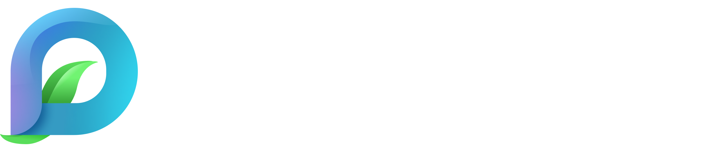

# DESIGN.md, Agent guide

> Read this first if you're an AI agent or contributor about to write code that uses the PocketSeed Design System. It's the philosophy, the rules, and the patterns that aren't obvious from reading the CSS.
>
> For **copy** (UI text, marketing, onboarding, anything user-facing), read [`VOICE.md`](VOICE.md), voice, tone, terminology, principles, and the words to avoid.

The visual language is in `css/`. Every primitive is a CSS class prefixed `.ps-`. Every design decision is a CSS custom property prefixed `--ps-`. **Don't reach for raw colors, sizes, or fonts, always use a token or a component class.**

---

## 0 · Philosophy

The system is **modern, friendly, light, and inviting**, it's there to build trust and let content breathe. It's not loud, not expressive, not performative, because PocketSeed lives **inside other brands**. A retailer's product page, a consultancy's report, a brand's marketing surface, each one needs to keep its own voice. PocketSeed sits in that frame like a credible third party, not a competing logo.

Think of it as a **nutrition label on a package**. The label has a recognisable visual language, clean type, organised data, restrained color, but it never fights with the brand of the food it sits on. It's strong *because* it's predictable. It works on a cereal box and a tofu tray and a fancy pasta jar without changes, because it doesn't try to be the protagonist.

That philosophy produces the rules:

- **Content does the work.** The data, the credential, the product, those are the protagonist. The system is the frame, never the picture.
- **Cues, not statements.** The palette leans into sustainability and trustworthy-tech (forest green on light, teal on dark, ink, warm paper). The cues are quiet, you'll never find a leafy nature scene or postcard imagery. We don't *describe* sustainability, we just sit comfortably next to it.
- **Restrained color.** One accent at a time. White space and rhythm carry more weight than any tint could.
- **Three voices in type, no more.** Inter for clarity, Instrument Serif italic for one editorial moment per surface, JetBrains Mono for micro-type. Resist the urge to add a fourth.
- **Tool, not theme.** It should feel like an instrument you reach for to communicate proof, not a travel site, not a nature project, not a hero brand campaign. The same pages should look at home in a CPG retailer's portal *and* on a B2B consultancy's deck.
- **Strong because it's simple.** Clean is the brand. Every component is built so it can disappear into a host context if it needs to, and step forward only when called on.

Personalization is on the roadmap. For now, the system is **agnostic by design**, and that is a feature, not a limitation.

If a design choice you're about to make feels expressive, decorative, or "branded", stop and ask whether the nutrition-label test still passes. If it doesn't, dial it back.

---

## 1 · The accent rule (most important)

The system uses a **two-tone accent**. Both tokens auto-switch by surface:

| Token | Use for | Light surface | Dark surface |
|---|---|---|---|
| `--ps-accent` | Text · eyebrow · serif italic accent · headline emphasis | Forest green `#2f7a3a` | Teal `#2dadc7` |
| `--ps-accent-vivid` | Outlines · dots · icons · accent-pill borders | Leaf green `#4caf50` | Teal `#2dadc7` |

**Always use `var(--ps-accent)`** for anything text-shaped, eyebrows, serif italic accents inside headlines, headlines emphasis, focus rings. **Use `var(--ps-accent-vivid)`** for dots, outlines, icons, and accent-pill chrome. Both auto-switch — never reach for `--ps-teal` or `--ps-green` directly.

```html
<!-- Right -->
<span class="ps-eyebrow">In one breath</span>            <!-- green on light, teal on dark -->
<span class="ps-serif" style="color: var(--ps-accent);">verifiable</span>

<!-- Wrong -->
<span class="ps-eyebrow" style="color: #2dadc7;">…</span>   <!-- never raw hex -->
<span class="ps-serif" style="color: var(--ps-teal);">…</span> <!-- locked to teal -->
```

The two-tone is what makes accent pills and icon dots pop: outline + dot in the brighter shade, text in the deeper one.

**Override only when** you need a different brand color regardless of surface. In that case use the preset modifiers, each defines its own `--ps-accent` / `--ps-accent-vivid` pair: `.ps-accent-teal`, `.ps-accent-blue`, `.ps-accent-green`, `.ps-accent-leaf`, `.ps-accent-purple`, `.ps-accent-ink`.

---

## 2 · Surfaces

The system has four standard surfaces. Each one carries text-color overrides so descendants don't need explicit colors. `.ps-bg-ink` and the stand-alone `.ps-card-ink` modifier also flip both `--ps-accent` and `--ps-accent-vivid` to teal automatically.

| Class | Background | Use |
|---|---|---|
| `.ps-bg-paper` | Warm cream `#f7f4ec` | Default page / slide |
| `.ps-bg-warm` | Slightly warmer cream | Variant slide background |
| `.ps-bg-card` | Pure white | Stand-alone card backgrounds |
| `.ps-bg-ink` | Deep ink `#1a2535` | Dark slide / hero pitch |

**Logo asset rule:**

- Light surfaces → `assets/pocketseed-logo.png` (dark wordmark)
- Dark surfaces (`.ps-bg-ink`) → `assets/pocketseed-logo-white.png` (light wordmark)
- Icon-only need (favicons, hero accent) → `assets/pocketseed-mark.png`

The `.ps-mark` class sizes via `--ps-mark-size` (default 40px). Don't try to recreate the mark in CSS, there used to be a `.ps-orb` component; it was removed.

---

## 3 · Two scales: slide vs web

Many components ship **two sizes** that switch automatically based on context:

- **Web scale (default)**, used everywhere by default. Built for 16px-base product / marketing pages.
- **Slide scale**, bigger numbers everywhere. Activates automatically when the component is inside `.ps-slide` or `.ps-stage`.

This applies to: `.ps-bullets`, `.ps-feature-card`, `.ps-pill`, `.ps-list-item`, and a few others.

**Implication:** if you're building a slide, **wrap your slide content in `.ps-slide`**, components scale up correctly. If you're building a web page or app UI, just use the components without that wrapper.

---

## 4 · Buttons have two scales too

Buttons are the most commonly mis-scaled element. The split:

| Class | Use | Look |
|---|---|---|
| `.ps-btn` (default) | App UI: forms, modals, toolbars, menus, dropdowns | Compact (14px / 8×14 padding), rounded square, no hover lift |
| `.ps-btn` + `.ps-btn-cta` | Marketing hero CTAs, landing-page buttons | Larger (16px / 14×24 padding), pill shape, lifts on hover |
| `.ps-btn` + `.ps-btn-lg` | Even bigger hero | 18px / 18×32, pill |

Variants (composable on either scale): `.ps-btn-primary`, `.ps-btn-accent`, `.ps-btn-ghost`, `.ps-btn-danger`. App-only sizers: `.ps-btn-sm`, `.ps-btn-icon`.

**Rule of thumb:** if it's a navigation, form action, or anything inside a panel/card → plain `.ps-btn`. If it's a hero CTA on a marketing page → add `.ps-btn-cta`.

---

## 5 · Typography ramps

Two ramps. Pick the one that matches the context.

**Slide ramp** (1920×1080, large display):
`.ps-h-mega` (200) · `.ps-h-display` (128) · `.ps-h-title` (76) · `.ps-h-section` (56) · `.ps-h-subtitle` (44) · `.ps-lead` (36) · `.ps-body-lg` (30) · `.ps-body` (26) · `.ps-small` (22)

**Web ramp** (16px base, product / marketing screens):
`.ps-web-display` (72) · `.ps-web-title` (48) · `.ps-web-section` (36) · `.ps-web-subtitle` (28) · `.ps-web-lead` (20) · `.ps-web-body` (16) · `.ps-web-small` (14)

**Don't mix ramps.** A web page using `.ps-h-title` will look enormous. A slide using `.ps-web-title` will look tiny.

**Decorative:**
- `.ps-serif`, italic editorial accent. Use on **one word per headline**, max. It's flavor, not a default.
- `.ps-mono`, micro-type only: IDs, codes, timestamps, eyebrow markers, URL strings. Never paragraphs.

`.ps-eyebrow` sits above headlines. Always uppercase, always tracked, always the accent color.

---

## 6 · Icons (Lucide)

[Lucide](https://lucide.dev) is the icon system. The convention has three rules baked into `.ps-icon`:

1. **Small by default** — 16px. Sizers: `.ps-icon-sm` (14) · `.ps-icon-lg` (20) · `.ps-icon-xl` (28).
2. **Always accent-coloured** via `var(--ps-accent)`, so icons auto-switch with the surface. Inside accent pills they pick up `--ps-accent-vivid` to match the dot. Inside buttons and tabs they inherit the parent's text colour (because those elements have their own active/muted states).
3. **stroke-width: 1.75**, lighter than Lucide's default 2, so they sit quieter beside Inter.

### Setup

Drop the CDN tag at the end of `<body>` and call `lucide.createIcons()` once. Lucide replaces every `<i data-lucide="name">` placeholder with the matching SVG, preserving classes and attributes:

```html
<script src="https://unpkg.com/lucide@latest"></script>
<script>lucide.createIcons();</script>

<span class="ps-pill ps-pill-accent">
  <i class="ps-icon" data-lucide="check"></i>
  Verified
</span>
```

Inside pills, icons auto-size to match the pill's text (13/12/10 for default/sm/xs). Don't set sizes manually unless you need to break the convention.

### When to use

- ✅ Tags, badges, status pills (icon adds glanceable signal: `check`, `shield-check`, `sparkles`)
- ✅ Feature-card numerator slots (replaces `01/02/03` with a concept icon: `shield-check`, `package`, `sprout`)
- ✅ Buttons (leading icon for actions, trailing arrow for "go forward" CTAs)
- ✅ Tabs with long admin-style strips (Overview, Evidence, Co-signers, Activity, Settings)
- ❌ Bullets — the dash is already the cue
- ❌ Body paragraphs — never sprinkle icons through prose
- ❌ Decorative-only — if removing the icon doesn't lose meaning, drop it

### Static contexts (no JS)

For server-rendered output, PDF exports, or anywhere `lucide.createIcons()` won't run, copy the SVG inline from [lucide.dev/icons](https://lucide.dev/icons/) with `stroke="currentColor"` so it still inherits `--ps-accent`.

---

## 7 · Component vocabulary (what to reach for)

When you need a… | …use this
---|---
Surface container | `.ps-card` (workhorse), `.ps-card-bare` (border-only), `.ps-card-tight` (compact), `.ps-card-ink` (stand-alone dark card)
Three-up feature grid | `.ps-feature-card` (numerator + accent pill + headline + body)
Tag / badge / status | `.ps-pill` (+ `-solid` / `-accent` / `-sm` / `-xs`)
Quiet bullet list | `.ps-bullets` (with a short accent dash)
Icon + title + sub list | `.ps-list-item` + `.ps-list-icon` + `.ps-list-title` + `.ps-list-sub`
Mockup of a web page | `.ps-browser` + `.ps-browser-bar` + `.ps-url`
Pull-quote on dark | `.ps-quote` (serif italic body, teal mark)
Mono index marker | `.ps-numarker`
Brand glyph | `` + `--ps-mark-size`
Ask-style input mock | `.ps-ask-bar`
Stat figure | `.ps-stat` + `.ps-stat-label` + `.ps-stat-value`
Slide chrome | `.ps-chrome` + `.ps-chrome-logo` + `.ps-chrome-meta`
Slide frame | `.ps-slide` (full-bleed inside `.ps-stage`)
Decorative grid | `.ps-grain`
Brand glow halo | `.ps-glow`
Image with rounded frame | `.ps-image-frame` (+ `-square` / `-wide` / `-pano`)
Multi-up image row | `.ps-image-grid` (+ `-2` / `-4`)
Layer pins / cards over an image | `.ps-image-stack` + `.ps-image-overlay`
Annotation pin on an image | `.ps-pin` (+ `.ps-pin-ink`)
Icon (Lucide) | `<i class="ps-icon" data-lucide="name">` (+ `.ps-icon-sm` / `-lg` / `-xl`) · always accent-coloured · auto-sizes inside pills

**Web app additions** (`webapp.css`):

- Forms: `.ps-field`, `.ps-label`, `.ps-input`, `.ps-textarea`, `.ps-select`, `.ps-input-group` + `-prefix`/`-suffix`, `.ps-helper` (+ `.ps-error`), `[aria-invalid="true"]` for invalid state
- Choice: `.ps-checkbox`, `.ps-radio`, `.ps-check-row`, `.ps-switch`
- Dropdown: `<details class="ps-dropdown">` + `.ps-menu` + `.ps-menu-item` (+ `-label` / `-divider` / `-danger` / `-shortcut`)
- Alerts: `.ps-alert` + `-info` / `-success` / `-warn` / `-error`
- Modal: `.ps-modal-overlay` + `.ps-modal-card` + `.ps-modal-header/body/footer`
- Avatar: `.ps-avatar` (+ `--ps-avatar-size`) + `.ps-avatar-stack`
- Tabs: `.ps-tabs` + `.ps-tab` (with `aria-selected="true"` for active)
- Table: `.ps-table`
- Auth: `.ps-auth-shell` + `.ps-auth-card` + `.ps-divider`

**Don't recreate any of these from scratch.** If you find yourself styling a `<button>` from raw CSS, stop and use `.ps-btn`.

---

## 8 · Layout helpers

Direct, opinionated, no Tailwind:

`.ps-grid-2` / `.ps-grid-3` / `.ps-grid-4` / `.ps-grid-5` · `.ps-flex` · `.ps-flex-col` · `.ps-items-center` / `-start` / `-end` / `-baseline` · `.ps-justify-between` / `-center` / `-end` · `.ps-flex-wrap` · `.ps-flex-1` · `.ps-relative` · `.ps-gap-{8,12,16,20,24,32,40,48,56,64}`

For anything more complex, write inline `style` or a one-off CSS rule. Don't add new utility classes to the system unless the pattern is genuinely repeated.

---

## 9 · Adding to a project

The fastest path is the public jsDelivr CDN, no install, no copy, just one line:

```html
<!-- pin to a major version (recommended) -->
<link rel="stylesheet" href="https://cdn.jsdelivr.net/gh/AGKDesigns/PocketSeed-Design-System-001@v1/css/pocketseed.css">

<!-- or, only the deck/marketing parts (no forms / dropdowns / modals): -->
<link rel="stylesheet" href="https://cdn.jsdelivr.net/gh/AGKDesigns/PocketSeed-Design-System-001@v1/css/components.css">
```

If a project copies the files locally instead, the path is `path/to/PocketSeed-Design-System-001/css/pocketseed.css`.

In a React / Vue / Svelte project:

```ts
import 'pocketseed-design-system/css/pocketseed.css';
```

Components are class names, they work the same in any framework. **Don't wrap them in framework components unless you're doing it for ergonomics.** The classes are the contract.

**Browse the spec site:** <https://pocketseed-design-system.pages.dev>. Fetch any seed's HTML for visual reference.

---

## 10 · Common mistakes (don't do these)

1. **Hardcoding hex values.** `color: #2dadc7` → use `var(--ps-teal)` or `var(--ps-accent)`.
2. **Using `var(--ps-teal)` on light surfaces.** Wrong color (light slides should be green). Use `var(--ps-accent)` and let it switch.
3. **Putting `.ps-bg-ink` and `.ps-card` on the same element.** `.ps-card`'s background wins the cascade and the card stays white. Either nest a `.ps-card` inside a `.ps-bg-ink` parent, or use `.ps-card-ink` for a stand-alone dark card.
4. **Using `.ps-btn-cta` inside an app.** It's marketing-scale, too big for forms, modals, toolbars. Use plain `.ps-btn`.
5. **Mixing slide and web type ramps in the same context.** Pick one based on the surrounding canvas size.
6. **Forgetting `.ps-slide` on a 1920×1080 slide.** Some components (bullets, feature cards, pills, list items) won't bump to slide-scale without it.
7. **Using the icon-only mark with a separate "POCKETSEED" text label.** Use the full lockup asset (`pocketseed-logo.png`), the wordmark is already in the PNG.
8. **Reaching for the orb.** It was removed. Use `.ps-mark` with `pocketseed-mark.png` instead.
9. **Stacking emphasis.** Bold + italic + accent color + larger size on the same word is too much. Pick one.
10. **Adding `<br>` tags to wrap headlines.** `.ps-h-title` and `.ps-h-section` already have `text-wrap: balance`. Let the browser do it.

---

## 11 · Pattern recipes

### Light content slide
```html
<div class="ps-slide ps-bg-paper ps-relative">
  <div class="ps-grain"></div>
  <header class="ps-chrome">
    
    <div class="ps-chrome-meta">
      <span>Section</span>
      <span>Audience</span>
      <span class="ps-mono">04 / 15</span>
    </div>
  </header>
  <div style="margin-top: 160px; display: grid; grid-template-columns: 1.15fr 1fr; gap: 80px; flex: 1; align-items: center;">
    <div>
      <span class="ps-eyebrow">Eyebrow</span>
      <h2 class="ps-h-title">Your headline, with a <span class="ps-serif" style="color: var(--ps-accent);">soft accent.</span></h2>
      <p class="ps-lead">Supporting paragraph.</p>
      <ul class="ps-bullets"><li>One</li><li>Two</li><li>Three</li></ul>
    </div>
    <div><!-- visual --></div>
  </div>
</div>
```

### Dark hero / pitch slide
```html
<div class="ps-slide ps-bg-ink ps-relative" style="justify-content: center;">
  <div class="ps-grain"></div>
  <div class="ps-glow"></div>
  <header class="ps-chrome">
    
    …
  </header>
  <div style="text-align: center; max-width: 1700px; margin: 0 auto;">
    <span class="ps-eyebrow">In one breath</span>
    <p class="ps-serif" style="font-size: 80px; line-height: 1.18; color: var(--ps-paper);">
      We make every claim <span style="color: var(--ps-accent); font-style: italic;">verifiable</span>.
    </p>
  </div>
</div>
```

### Auth screen
```html
<div class="ps-auth-shell">
  <div class="ps-auth-card">
    <div class="ps-auth-head">
      
      <h1>Sign in to your workspace</h1>
    </div>
    <form class="ps-auth-form">
      <div class="ps-field">
        <label class="ps-label" for="email">Email</label>
        <input class="ps-input" id="email" type="email" />
      </div>
      <button class="ps-btn ps-btn-primary">Sign in</button>
    </form>
  </div>
</div>
```

### Marketing CTA group
```html
<div class="ps-flex ps-gap-12">
  <a class="ps-btn ps-btn-cta ps-btn-primary" href="#">Get a demo</a>
  <a class="ps-btn ps-btn-cta ps-btn-ghost" href="#">See it in action →</a>
</div>
```

### Compose, don't diagram

Show how things relate by layering, not by drawing connection lines. A product image with a credential card overlapping the right edge tells the story by proximity. Use flex + a negative margin so the overlap is predictable:

```html
<div style="display: flex; align-items: center; padding: 56px 40px;
            background: var(--ps-paper-warm); border-radius: var(--ps-radius-2xl);">
  <div class="ps-image-frame ps-image-square" style="width: 480px; flex-shrink: 0;">
    
  </div>
  <div class="ps-browser" style="width: 420px; margin-left: -160px; margin-top: 60px;
                                 box-shadow: 0 30px 60px -25px rgba(26,37,53,0.28);
                                 position: relative; z-index: 2;">
    <!-- credential card content using existing primitives -->
  </div>
</div>
```

The image stays dominant; the card nestles in. No SVG paths, no hand-positioned dots — the relationship is visible from the layout alone.

### Annotated image

For "what's special about this product" callouts, layer pins on a square frame:

```html
<div class="ps-image-stack">
  <div class="ps-image-frame ps-image-wide">
    
  </div>
  <div class="ps-image-overlay">
    <span class="ps-pin" style="top: 18%; left: 50%;">Bamboo dropper</span>
    <span class="ps-pin" style="top: 56%; left: 56%;">Recycled glass</span>
    <span class="ps-pin ps-pin-ink" style="bottom: 18px; right: 18px;">3 verified credentials</span>
  </div>
</div>
```

---

## 12 · When the system doesn't have what you need

1. Check `specimens/` first, there may be an example you missed.
2. If the pattern is a one-off, write inline `style` and move on.
3. If the pattern repeats across contexts, **extend the system** rather than working around it: add a token, add a component class to the right file, add a specimen page entry, update this DESIGN.md and the README.
4. **Don't fork tokens.** Adding `--my-app-blue` defeats the system. If you need a new shade, add it to `tokens.css` so everyone gets it.
